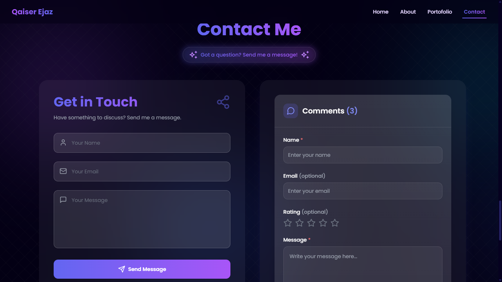

<div align="center">
  <h1>🚀 Welcome to my Portfolio Website!</h1>
  <p>I'm Qaiser Ejaz, a passionate Full Stack Developer showcasing my journey through this interactive platform.</p>
</div>

<p align="center">
<!-- Core Technologies -->


<!-- Styling & UI -->


<!-- State Management & Backend -->


<!-- Development Tools -->


<!-- Animation & UI Libraries -->


<!-- Deployment -->

</p>

## 📑 Table of Contents
1. [Technology Stack](#-technology-stack)
2. [Portfolio Preview](#-portfolio-preview)
3. [Features](#-features)
4. [Live Demo](#-live-demo)
5. [Quick Start](#-quick-start)
6. [Firebase Setup](#-firebase-setup)
7. [Build & Deploy](#-build--deploy)
8. [Environment Variables](#-environment-variables)
9. [Contributing](#-contributing)
10. [License](#-license)
11. [Acknowledgments](#-acknowledgments)

## 📸 Portfolio Preview

<div align="center">
  
  
  <div style="display: grid; grid-template-columns: repeat(2, 1fr); gap: 10px; margin-top: 10px;">
    
    
    
    
    
  </div>
</div>

## ✨ Features

- 📱 Fully Responsive Design
- 🎨 Modern UI/UX with Tailwind CSS
- 🔥 Firebase Integration (Firestore & Realtime DB)
- 📊 Dynamic Project Showcase
- 🎓 Interactive Certificate Gallery
- 💼 Animated Work Experience Timeline
- 🛠️ Skills & Tech Stack Display
- 📬 Contact Form with Email Integration
- ✨ Smooth Page Transitions & Animations
- 📱 Mobile-Friendly
- 🔍 SEO Optimized
- 📈 Performance Analytics
- 🚀 Fast Loading with Code Splitting
- 🔒 Secure Data Handling

## 🛠️ Tech Stack

### Core Technologies
- ⚛️ React.js with Vite
- 📜 JavaScript/JSX
- 🌐 HTML5/CSS3

### Styling & UI
- 🎨 Tailwind CSS
- 🎯 Material UI (MUI)
- 💅 Emotion (CSS-in-JS)

### Animation Libraries
- 🎭 Framer Motion
- 📜 AOS (Animate On Scroll)
- 🌊 React Spring
- ✨ Anime.js
- 🎬 Lottie Files

### Icons & SVGs
- 🎨 Lucide Icons
- 🖼️ SVG Images

### State Management & Data
- 🔥 Firebase Suite
  - 📚 Firestore
  - 🔄 Realtime Database
  - 🔐 Authentication
- 📝 Form Handling
  - 📋 React Hook Form
  - 📤 Form Submit

### Routing & Navigation
- 🛣️ React Router DOM v6
- 🔒 Protected Routes
- 📱 Dynamic Routing

### Data Fetching & API Integration
- 📡 Fetch API
- 📦 Axios

### UI Components & Icons
- 🎯 Headless UI
- 🎨 Material Icons
- ✨ Lucide Icons
- 🔔 SweetAlert2

### Development Tools
- 📦 npm/yarn
- 🔧 ESLint
- 💅 Prettier
- 🧪 Jest for Testing
- 🔍 Chrome DevTools
- 📝 VS Code

### Performance & Analytics
- 📊 Vercel Analytics
- ⚡ Vercel Speed Insights
- 🔍 Google Analytics
- 📈 Google AdSense
- 🔍 SEO Optimized

### Deployment & Hosting
- ▲ Vercel Platform

## 🔗 Live Demo
[Visit Portfolio](https://qaiserejaz-portfolio.vercel.app/)

## 🚀 Quick Start

### Prerequisites
- Node.js (v16 or higher)
- npm/yarn
- Git

### Installation

1. Clone the repository
```bash
git clone https://github.com/QaiserEjaz/qaiserejaz-portfolio.git
cd qaiserejaz-portfolio
```

2. Install dependencies
```bash
npm install
# or with legacy peer deps if needed
npm install --legacy-peer-deps
 ```

3. Start development server
```bash
npm run dev
 ```

## 🔥 Firebase Setup
1. Create a Firebase project
2. Enable services:
   - 📚 Firestore Database
   - 🔄 Realtime Database
   - 🔐 Authentication
   - 📤 Storage
3. Update Firebase config in src/firebase.js
## 📦 Build & Deploy
```bash
# Create production build
npm run build

# Preview production build
npm run preview

# Deploy to Vercel
vercel
```

## 🔧 Environment Variables
Create .env file:

```env
VITE_FIREBASE_API_KEY=your_api_key
VITE_FIREBASE_AUTH_DOMAIN=your_auth_domain
VITE_FIREBASE_PROJECT_ID=your_project_id
VITE_FIREBASE_STORAGE_BUCKET=your_storage_bucket
VITE_FIREBASE_MESSAGING_SENDER_ID=your_messaging_sender_id
VITE_FIREBASE_APP_ID=your_app_id
```

## 🤝 Contributing
1. Fork the repository
2. Create feature branch
3. Commit changes
4. Push to branch
5. Open pull request
## 📝 License
This project is available for use with attribution. Please include credits when using this template.

## 🙏 Acknowledgments
Special thanks to all contributors and the open-source community!

<div align="center">
  Made with ❤️ by <a href="https://github.com/QaiserEjaz">Qaiser Ejaz</a>
</div>


